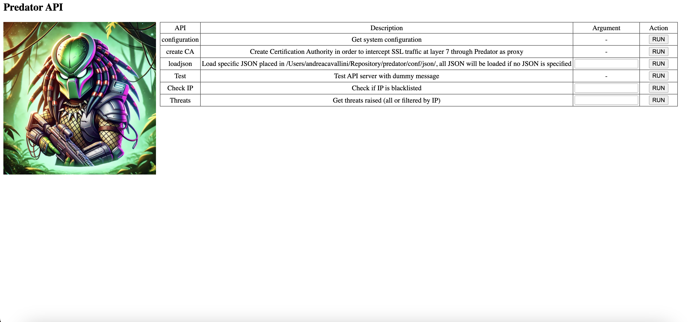

# Predator
Predator IDS and Proxy Solution

## Main Concepts
- **NIDS (Network Intrusion Detection System)**: A tool used to identify threats inside a network based on a set of user-defined rules.
- **Proxy**: A tool that provides a single Internet access point with SSL termination to inspect encrypted traffic.

## Overview
Predator is designed to meet the following needs:
- Easy integration of rules.
- Modularity.
- Multithreaded, usable, and fast.
- Syslog log redirection for third-party analysis (e.g., SIEM).

Configuration is managed in `config.py`.

## Rules Integration
By default, Predator can ingest rules generated by the [Anubi Signatures project](https://github.com/kavat/anubi-signatures). It supports rules based on:
- **IP**: Files with the `_ip.json` suffix.
- **TOR nodes**: `tor_nodes.list` file.
- **Domain**: Files with the `_fqdn.json` suffix.
- **Payload**: `patterns_tcp_udp.json` file.

### Example Formats
- **IP and Domain Rules**: JSON files with keys as IPs or domains and values as CTI descriptions.
  ```json
  {"1.10.146.175": "misp", "1.117.62.81": "misp", ...}
  ```
  Default sources file names: `anubi_YYYY_MM_ip.json`, `anubi_YYYY_MM_fqdn.json`.
  Custom file names shall have `_ip` as suffix before json extensione.

- **Payload Rules**: JSON files with arrays of patterns.
  ```json
  ["PATTERN_1", "PATTERN_2", "PATTERN_3", ...]
  ```
  File name: `patterns_tcp_udp.json`.

## Modules
### Layer 4 Source/Destination Control and Layer 7 Pattern Match
- Monitors incoming/outgoing connections against malicious IPs and patterns.
- Controlled via `IDS` setting in `config.py` (default: `True`):
  ```python
  IDS = True
  ```

### API
Provides user interaction with the system, such as updating rules without restarting the tool.
#### Features
- **Help**: Lists available features.
  ```bash
  curl -XPOST http://127.0.0.1:10000/api -H "content-type: application/json" -d '{"func":"help"}'
  ```

- **Create CA**: Creates a Certification Authority certificate for SSL inspection.
  ```bash
  curl -XPOST http://127.0.0.1:10000/api -H "content-type: application/json" -d '{"func":"createca"}'
  ```

- **Load JSON Rules**: Loads new rules from the specified file without restarting.
  ```bash
  curl -XPOST http://127.0.0.1:10000/api -H "content-type: application/json" -d '{"func":"loadjson","file_json":"test.json"}'
  ```
  if no file_json parameter is provided, all rules will be reloaded


#### Default Settings
- Enabled in `config.py`:
  ```python
  API = True
  ```
- Management console available at `http://127.0.0.1:10000`.

#### Web UI
A simple web interface is provided for interacting with Predator:


### Proxy
- Performs SSL termination and traffic inspection based on rules.
- Controlled via `PROXY` setting in `config.py` (default: `False`):
  ```python
  PROXY = False
  ```

### Dummy
- Replicates decrypted traffic to an internal network for third-party analysis (e.g., Suricata).
- Controlled via `DUMMY` setting in `config.py` (default: `False`):
  ```python
  DUMMY = False
  ```

## Custom Tags
- **HTTP Connections**: The `Host` field is isolated and logged for potential whitelisting.
- **HTTPS Connections**: The `SNI` field in TLS extensions is isolated and logged.

## Configuration (`config.py`)
Important settings include:
- **Log Paths**:
  ```python
  PATH_LOGGER_PREDATOR_MAIN = '/var/log/predator.log'
  PATH_JSON = "/opt/predator/conf/json/"
  ```
- **Proxy Settings**:
  ```python
  PROXY_HOST = "127.0.0.1"
  PROXY_PORT = 7777
  ```
- **IDS Interfaces**:
  ```python
  NICS_TO_SNIFF = ["eth0"]
  ```

## Dependencies
1. Clone the project (e.g., `/opt/predator`):
   ```bash
   apt install python3 python3-pip python3-venv git libpcap-dev curl
   cd /opt/predator
   python3 -m venv predator_env
   source predator_env/bin/activate
   pip3 install scapy flask brotli websocket cryptography geoip2
   mkdir -p /opt/predator/var/{log,run}
   ```

## Starting Predator
1. Load rules:
   ```bash
   /opt/predator/predator.sh rules
   ```
2. Start Predator:
   ```bash
   python3 ./predator.py
   # or
   ./predator.sh start
   ```
   **Note**: Root privileges are required.

## Screenshots
- **Status**:
  
- **Threats Identified**:
  
