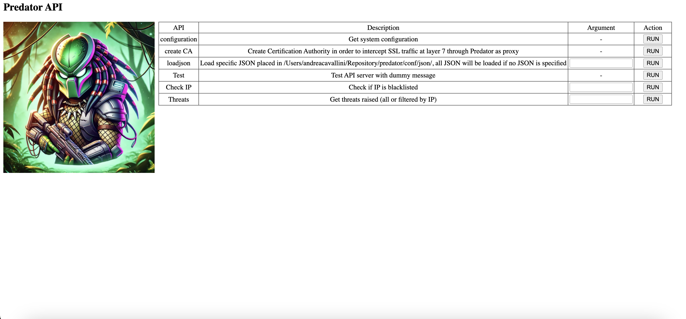

# Predator modules
## Layer 4 Source/Destination Control and Layer 7 Pattern Match
Monitors incoming/outgoing connections against malicious IPs/domains and patterns.

### Default Settings
Controlled via `IDS` setting in `config.py` (default: `True`):
  ```python
  IDS = True
  ```
### Custom Tags
- **HTTP Connections**: The `Host` field is isolated and logged for potential whitelisting.
- **HTTPS Connections**: The `SNI` field in TLS extensions is isolated and logged.

## API
Provides user interaction with the system, such as updating rules without restarting the tool.
### Examples
- **Help**: Lists available features.
  ```bash
  curl -XPOST http://MANAGEMENT_HOST:MANAGEMENT_PORT/api -H "content-type: application/json" -d '{"func":"help"}'
  ```

- **Create CA**: Creates a Certification Authority certificate for SSL inspection.
  ```bash
  curl -XPOST http://MANAGEMENT_HOST:MANAGEMENT_PORT/api -H "content-type: application/json" -d '{"func":"createca"}'
  ```

- **Load JSON Rules**: Loads new rules from the specified file without restarting.
  ```bash
  curl -XPOST http://MANAGEMENT_HOST:MANAGEMENT_PORT/api -H "content-type: application/json" -d '{"func":"loadjson","file_json":"test.json"}'
  ```
  if no file_json parameter is provided, all rules will be reloaded

### Default Settings
Controlled via `API` setting in `config.py` (default: `True`):
  ```python
  MANAGEMENT_HOST = "127.0.0.1"
  MANAGEMENT_PORT = 10000
  API = True
  ```
A simple interface is provided as management console and it is available at `http://MANAGEMENT_HOST:MANAGEMENT_PORT`.



## Proxy
Performs SSL termination and traffic inspection based on rules.

### Default Settings
Controlled via `PROXY` setting in `config.py` (default: `False`):
  ```python
  PROXY_HOST = "127.0.0.1"
  PROXY_PORT = 7777
  PROXY = True
  ```

## Dummy
Replicates decrypted traffic to an internal network for third-party analysis (e.g., Suricata).

### Default Settings
Controlled via `DUMMY` setting in `config.py` (default: `False`):
  ```python
  DUMMY_HOST = "127.0.0.1"
  DUMMY_PORT = 9999
  DUMMY = False
  ```

## Reverse Proxy
Performs ingress traffic inspection before redirecting to upstream.

### Default Settings
Controlled via `REVERSE_PROXY` setting in `config.py` (default: `False`):
  ```python
  REVERSE_PROXY_HOSTS = [
    {"host": "0.0.0.0", "port": 443, "ssl": True, "upstream": "https://github.com"},
    {"host": "0.0.0.0", "port": 8080, "ssl": False, "upstream": "http://security.ubuntu.com/ubuntu"}
  ]
  REVERSE_PROXY = True
  ```

